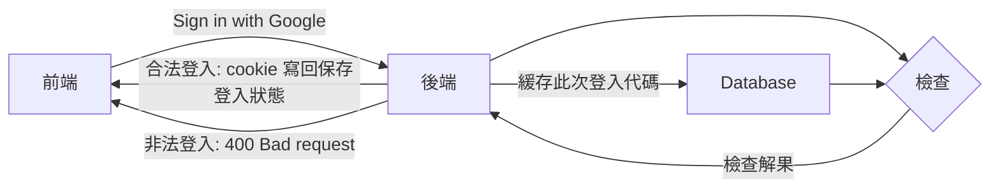
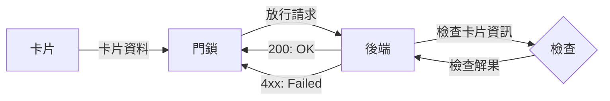

# watchcat.server

這是2024資訊科展項目*watchcat*的後端伺服器部分

## 特點
- 經過Sqlmap測試，未檢測出sql injection漏洞
- 純 Rust 實現
- 使用基於最新最熱的異步IO庫tokio開發的actix-web框架

## 動機

已知開門需要鑰匙  
又知人人皆有手機/學生證

那爲何不用手機或學生證開門呢？

## 如何工作

手機使用Google登入



門鎖端利用卡片登入



## 遇過的困難

### 語言層面不支持

Google 未提供 Rust 的相關套件，
所以無法像其他語言一樣直接調用官方套件一行解決：

```javascript
function onSignIn(googleUser) {
  var profile = googleUser.getBasicProfile(); // 好了到這一步Google已經幫你把東西弄好了
}
```
### 解決方法
手搓一個解密流程


先確認這次登入是否與Google留下的cookie相符
```rust
// Check if post-request token and cookie token are met.
if cookie_token.is_none() || cookie_token.unwrap().value() != post_request_token {
    return Ok(HttpResponse::BadRequest().body("Failed to verify user."));
}

```

此處省略冗長的JWT解密
```rust

// Decode
let decoded_cred = match jwt_decoder(token, jwt_cert).await {
    Err(e) => {
        error!("{:?}", e);
        return Ok(HttpResponse::InternalServerError().finish());
    }
    Ok(val) => val,
};
```

確認解密後的資料是否爲Google發送/簽名的
```rust
// If the JWT is not issued by Google, should the token be considered as forged by others? 🤔
let iss = &payload.iss;
if !(iss == "accounts.google.com" || iss == "https://accounts.google.com") {
    warn!("Unknown JWT issuer! {:?}", iss);
    warn!("{:?}", payload);
    return Ok(HttpResponse::BadRequest().body("Invalid token."));
}
```


確認是否藏有特殊字元（防範注入攻擊）
```rust
// IMPORTANT: Ensure `sub` and `email` both does not contain ANY specical characters.
if RE_SUB.is_match(sub) || RE_EMAIL.is_match(email) {
    warn!("Suspicious values.");
    warn!("payload: {:?}", payload);
    return Ok(HttpResponse::BadRequest().body("Invalid token."));
}
```

## 後續計劃

推出非網頁/APP的版本~~瀏覽器套殼~~  
方便支持藍牙開鎖  
（不過那是前端的事了）
